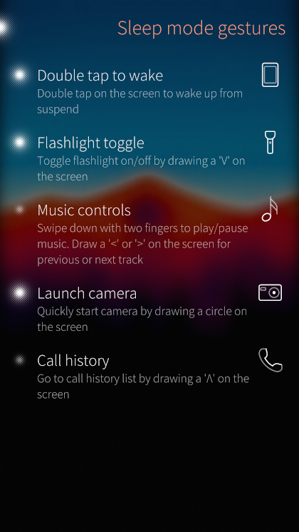
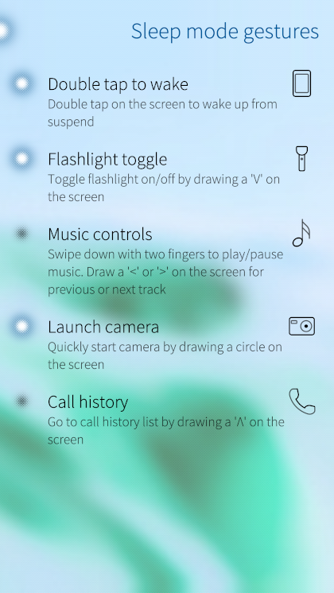

# onyx-gesture-settings-plugin
A fork of @kimmoli's [original handy settings plugin](https://github.com/kimmoli/onyx-gesture-settings-plugin) for managing your enabled [gesture-daemon](https://github.com/sailfishos-oneplus5/gesture-daemon) gestures with minor tweaks and improvements.

## Screenshots

